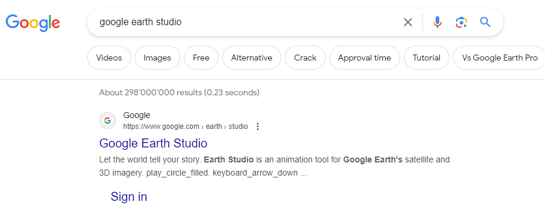

# Erste Schritte mit Google Earth Studio

Um mit Google Earth Studio zu beginnen, befolgen Sie diese Schritte:

1. Öffnen Sie einen Webbrowser, der auf dem Chrome-Motor basiert.

2. Suchen Sie nach **"Google Earth Studio"**.

3. Öffnen Sie den ersten [Link](https://www.google.com/earth/studio/).

## Kontoanmeldung

Klicken Sie zunächst auf **"Earth Studio ausprobieren"**. Dies bringt Sie zu einer Anmeldeseite.

Sie müssen sich mit Ihrem Google-Konto registrieren, um diesen Service zu nutzen.

Hinweis: Obwohl es möglich ist, auch andere Konten als Google zu verwenden, ist dies komplizierter.

## Projekt erstellen

Google Earth Studio funktioniert ähnlich wie Adobe After Effects und ermöglicht es Ihnen, an kleinen Projektkacheln zu arbeiten, um Szenen zu erstellen. Um zu beginnen, klicken Sie auf **"Leeres Projekt"**.

## Projekteinstellungen

Beim Erstellen eines neuen Projekts ist es wichtig, verschiedene Parameter zu verstehen, darunter:

- [**Name**](#Name)
- [**Welt**](#Welt)
- [**Abmessungen**](#Abmessungen)
- [**Dauer**](#Dauer)
  - [**Frames**](#Frames)
  - [**Sekunden**](#Sekunden)
- [**Bildrate**](#Bildrate)

Diese Parameter sind entscheidend und werden wichtiger, wenn Sie sich mit Google Earth Studio vertraut machen und fortgeschrittene Animationen und Videos erstellen können. Klicken Sie auf jeden Parameter, um mehr zu erfahren.

## Arbeitsfenster und Benutzeroberfläche

[Beschreiben Sie das Arbeitsfenster und die Benutzeroberfläche hier]

# Ihre erste Animation mit Earth Studio erstellen

In diesem Abschnitt lernen Sie, wie Sie Ihre erste Animation mit Google Earth Studio erstellen. Wir erstellen einen kurzen Clip, der den Übergang unserer Schule vom Weltraum zu ihrem Standort zeigt.

[Fügen Sie den Videolink oder das Medium ein]

# Was ist Google Earth Studio

Google Earth Studio ist ein webbasiertes Animationswerkzeug, das von Google entwickelt wurde, um animierte Videos und Bilder unter Verwendung von Google Earth- und Maps-Daten zu erstellen.

## Geschichte

- **28. November 2018:** Google Earth Studio wurde offiziell von Google angekündigt und gestartet.
- **Ende 2018 - Anfang 2019:** Es wurde bei Content-Erstellern und Animatoren beliebt.
- **Erste Release-Funktionen:** Google Earth Studio bietet sowohl eine kostenlose Version mit begrenzten Funktionen als auch eine kostenpflichtige Version.
- **Laufende Entwicklung:** Kontinuierliche Entwicklung zur Verbesserung von Funktionen und Benutzererfahrung.

## Verwendungen heute

Google Earth Studio wird für folgende Zwecke genutzt:

1. [**Marketing und Werbung**](https://example.com/marketing-advertising) - Erstellung ansprechender Animationen für Werbezwecke.

2. [**Bildungsinhalte**](https://example.com/educational-content) - Visualisierung von Geografie und Geschichte für Bildungszwecke.

3. [**Umweltanalyse**](https://example.com/environmental-analysis) - Verfolgung von Umweltveränderungen und Naturkatastrophen.

4. [**Tourismusförderung**](https://example.com/tourism-promotion) - Bereitstellung virtueller Touren von Reisezielen.

5. [**Immobilienrundgänge**](https://example.com/real-estate-tours) - Präsentation von Immobilien auf einzigartige Weise.

6. [**Eventförderung**](https://example.com/event-promotion) - Erstellung von Überblicken über Veranstaltungsorte.

7. [**Filmproduktion**](https://example.com/filmmaking) - Hinzufügen von Luftaufnahmen und Flugüberflügen zu Produktionen.

8. [**Stadtplanung**](https://example.com/urban-planning) - Visualisierung von städtischen Entwicklungsprojekten.

9. [**Wissenschaftliche Forschung**](https://example.com/scientific-research) - Unterstützung von Forschung mit visuellen Daten.

10. [**Individuelle Kartenerstellung**](https://example.com/custom-map-creation) - Erstellung personalisierter Karten für verschiedene Zwecke.

Diese Anwendungen zeigen die Vielseitigkeit von Google Earth Studio bei der Erstellung fesselnder visueller Inhalte.

# Parameter

Wie Sie oben gesehen haben, gibt es viele Faktoren, die Sie berücksichtigen müssen, um ein Studio-Projekt zu erstellen. Hier werde ich etwas genauer auf diese Parameter und ihre Bedeutung eingehen.

## Projektkonfigurationen

### Name

Der Name Ihres Projekts. Meine Empfehlung ist, diesen Namen kurz und leicht verständlich zu halten. Dies erleichtert es Ihnen in der Zukunft oder anderen Personen, die Ihr Projekt verwenden werden.

### Welt

Earth Studio unterstützt mehrere Himmelskörper, darunter Erde, Mond und Mars. Dies gibt Ihnen viel kreative Freiheit.

### Abmessungen

Ihre Ausgabeauflösung beim Speichern von Schnappschüssen oder Rendern eines Projekts. Wenn eine Dimension geändert wird, passt Earth Studio die andere an, um das Seitenverhältnis Ihres Projekts beizubehalten. Sie können die Abmessungen durch Klicken auf das Symbol entsperren. Earth Studio unterstützt eine maximale Auflösung von 4096x2304.

### Dauer

Die Länge Ihres Projekts. Beim Ändern der Länge fügt Earth Studio standardmässig einfach die Differenz in Frames hinzu oder subtrahiert sie. Sie können Ihre vorhandenen Keyframes auf die neue Dauer skalieren, indem Sie das entsprechende Kontrollkästchen aktivieren.

#### Frames

Dies ist leicht verständlich, da Ihr Projekt Frames als zeitliche Bewegung verwendet. Dies ermöglicht Ihnen eine feine und präzise Messung.

#### Sekunden

Das ist selbsterklärend. Wir können die Sekundenoptionen verwenden, um die Projektlänge festzulegen.

### Bildrate

Die Bildrate in der Videoproduktion bezieht sich auf die Anzahl der Frames oder Bilder, die pro Sekunde in einem Video angezeigt werden. Gängige Bildraten sind 24 fps für einen kinoreifen Look, 30 fps für Standardvideo und 60 fps für flüssige Bewegungen. Höhere Bildraten wie 120 fps werden für Zeitlupeneffekte verwendet. Die Wahl der Bildrate beeinflusst die Bewegung und den visuellen Stil des Videos.

Wenn Sie eine Videoerklärung wünschen, hier ist ein grossartiges [Beispiel]()

# UI/UX Earth Studio

Ich werde die Benutzeroberfläche in Earth Studio Schritt für Schritt durchgehen. So erhalten Sie einen sehr detaillierten Überblick darüber, wie Sie die Software verwenden. Dieser Abschnitt ist auch sehr nützlich, wenn Sie auf ein bestimmtes Werkzeug verweisen müssen.

## Startbildschirm

Dies ist der Bildschirm, den Sie nach der Konfiguration Ihrer Projekteinstellungen sehen werden (Projektscreenshot). Dies kann am Anfang sehr überwältigend sein, aber wir werden es Stück für Stück durchgehen, damit es für Sie leicht verständlich wird.

## Suche-Symbol.png

Die Anwendungsoberfläche verfügt über eine prominente Suchleiste oben, begleitet von einer Taskleiste mit sechs wesentlichen Schaltflächen. Lassen Sie uns in die Funktionen jeder einzelnen eintauchen:

1. [**Datei**](#Das-Datei-Menü) - Dieser Abschnitt ist der Verwaltung Ihrer Dateien gewidmet und bietet Optionen wie das Erstellen neuer Projekte, das Öffnen vorhandener Projekte und den Zugriff auf kürzlich geöffnete Projekte.

2. [**Bearbeiten**](#Bearbeiten) - Der Bearbeiten-Bereich bietet grundlegende Funktionen für die Dateibearbeitung, einschliesslich Rückgängig, Wiederholen, Ausschneiden, Kopieren, Einfügen, Löschen, Alles auswählen und Abwählen.

3. [**Ansicht**](#Ansicht) - Passen Sie die Anzeigeoptionen Ihrer Dateien in diesem Abschnitt an. Er umfasst Einstellungen für Mehrfachansicht, Vorschauqualität, Hilfslinien, Vollbildumschaltung, Ansichtsportmaskierung, verfügbare Bereiche, Kartenstil und Verfolgungspunkte.

4. [**Overlays**](#Overlays) - Erkunden Sie den Overlays-Bereich, um Ihre Dateien mit importierten Overlay-Dateien oder Verfolgungspunkten zu verbessern. Dieser Abschnitt behandelt auch Exportoptionen für After Effects und Anleitungen zum Erhalt von 3D-Verfolgungspunkten.

5. [**Animation**](#Animation) - Erstellen Sie dynamische Inhalte mit Animationsfunktionen. Der Animationsbereich enthält Rendierungsoptionen, Animationseinstellungen wie Auto-Ease, Ein-/Aus-Ease, Linear und Schritt.

6. [**Hilfe**](#Hilfe) - Finden Sie Unterstützung und Ressourcen im Hilfe-Bereich, der Dokumentation, ein Benutzerforum, die Möglichkeit zur Feedbackabgabe und eine umfassende Liste der Tastenkombinationen umfasst.

7. [**Suchsymbol**](#Suchsymbol) - Verwenden Sie die Suchfunktion mit dem Suchsymbol, um Inhalte effizient in Ihren Dateien zu finden.

### Das Datei-Menü

Hier finden Sie die Kernsteuerelemente für Ihr Projekt.

#### Neu / Öffnen / Zuletzt öffnen

Mit diesem Menü können Sie ein neues Projekt starten, vorhandene Projekte öffnen oder schnell auf zuletzt geöffnete Projekte zugreifen.

Eine sehr coole Funktion in diesem Menü sind die vordefinierten Animationsfunktionen, die Sie unter "Neu" finden. Diese sind Lebensretter, wenn Sie eine einfache Animation erstellen müssen und dies schnell tun müssen. Jetzt gehen Sie einfach zu Neu und wählen aus, welche Sie möchten. Obwohl diese Funktion sehr nützlich ist, hat sie ihre Grenzen. Wenn Sie komplexere und ausgearbeitete Animationen erstellen möchten, müssen Sie dies selbst tun.

#### Speichern / Speichern unter

Speichern Sie effizient Ihr aktuelles Projekt oder erstellen Sie eine neue Kopie mit einem anderen Namen mit den Optionen Speichern und Speichern unter.

#### Importieren

Während Overlays und KMLs das Hinzufügen einfacher Elemente zur Erdansicht ermöglichen (z. B. Text, Grenzen und Formen), müssen komplexere Elemente ausserhalb von Earth Studio hinzugefügt werden.

3D Camera Export, der derzeit mit Adobe After Effects kompatibel ist, macht diesen Prozess unglaublich einfach. Durch das native Exportieren von Kameradaten aus Earth Studio können Sie sicherstellen, dass zusammengesetzte Elemente perfekt mit Ihrem Filmmaterial übereinstimmen.

Sie können auch Track Points erstellen und zusammen mit den Kameradaten eines Projekts exportieren. Track Points werden in After Effects als Null-Objekte dargestellt und sind hilfreich, um Elemente in Ihrer Szene zu positionieren. Legen Sie einen Track Point an einer beliebigen Stelle fest, an der Sie ein Element in der Postproduktion platzieren möchten, oder legen Sie einige als Referenz fest.

Werfen Sie einen Blick auf unsere Berechtigungen für weitere Informationen zu Annotationen und dem Hinzufügen benutzerdefinierter Grafiken über Google Earth-Bilder.

#### Exportieren

Wenn Sie Ihre Kamera- und Track-Punkte ausserhalb von Earth Studio verwenden möchten, müssen Sie diese Daten in einem Format exportieren, das ein Programm eines Drittanbieters verstehen kann.

Für After Effects handelt es sich dabei um eine Adobe ExtendScript-Datei (.jsx), die die Kamera und alle Track-Punkte in einer neuen After Effects-Komposition neu erstellt.

##### Exportieren mit Rendern
In den meisten Fällen ist es am besten, Tracking-Daten zusammen mit einem Rendern zu exportieren. Dadurch wird sichergestellt, dass Ihre Kamera und Track-Punkte perfekt auf dem zugrunde liegenden Filmmaterial aktualisiert sind.

Um Tracking-Daten beim Rendern zu erhalten, wählen Sie das gewünschte Format unter 3D-Tracking-Daten in den erweiterten Einstellungen aus. Das Tracking-Datenskript wird zusammen mit Ihrer Bildsequenz und der Projektdatendatei im resultierenden Zip enthalten sein.

##### Exportieren als eigenständiges Skript
In einigen Situationen müssen Sie möglicherweise Tracking-Daten für ein Projekt exportieren, das bereits gerendert wurde. Sie müssen beispielsweise zusätzliche Trackpunkte zu einer vorhandenen Animation hinzufügen.

Jederzeit können Sie Datei > Exportieren > 3D-Tracking-Daten verwenden, um Tracking-Daten ohne erneutes Rendern zu exportieren. Wählen Sie die Tracking-Elemente aus, die Sie benötigen (3D-Kamera und/oder Trackpunkte), und Earth Studio wird Ihre Tracking-Daten als .jsx- oder JSON-Datei herunterladen.

#### Projekteinstellungen

Hier finden Sie die Hauptprojekteinstellungen wie zuvor im [**Startmenü**](#Projektkonfigurationen). Und Sie können alles wie zuvor ändern.

#### Einstellungen

Passen Sie Ihre Benutzererfahrung an, indem Sie Einstellungen in den folgenden Kategorien konfigurieren:

- [**Allgemein**](#allgemein) - Erkunden und anpassen allgemeiner Einstellungen für die Anwendung.
- [**Projekt**](#projekt) - Passen Sie Einstellungen im Zusammenhang mit der Projekt-Konfiguration an.
- [**Rendern**](#rendern) - Feinabstimmung von Optionen und Konfigurationen für den Rendervorgang.
- [**Benutzer**](#benutzer) - Personalisieren Sie Einstellungen, die spezifisch für Ihr Benutzerprofil sind.

##### Allgemein

Im Allgemeinen finden Sie Ihre Startseite. Dies ist die Seite, die Ihnen zu Beginn Ihres Projekts angezeigt wird. Sie finden auch "Standard-Multiansicht". Darunter sehen Sie die Standard-Wiedergabe. Der Wiedergabemodus zyklisiert standardmässig, kann aber auch ping-pongen (rückwärts abspielen) oder stoppen.

##### Projekt

Hier finden Sie fast die gleichen Einstellungen wie im [**Startmenü**](#Projektkonfigurationen), jedoch mit einigen detaillierteren Attributen. Diese können den Kartenstil, die Atmosphäre und die Wolken-Einstellungen festlegen.

##### Rendern

Sehr einfach. Wie das Projekt gerendert wird, wenn die Rendertaste geklickt wird. Und ermöglicht es Ihnen, weitere Projekte mit denselben Aktionen zu rendern.

##### Benutzer

Hier finden Sie die gleichen Einstellungen wie im Google Account Manager, aber angepasst an jedes Studio. Wie Suchverlauf, Daten aus Ihren Projekten und das Zurücksetzen des gesamten Editors auf die Werkseinstellungen, was bei der Fehlerbehebung sehr nützlich ist.

### Bearbeiten

Der Abschnitt "Bearbeiten" beherbergt grundlegende Funktionen, die für die Dateimanipulation unerlässlich sind. Jede Funktion wird unten detailliert beschrieben:

- **Rückgängig machen (Strg+Z):**

  - _Beschreibung:_ Setzen Sie die letzte Aktion in Ihrem Projekt zurück.

- **Wiederholen (Strg+Y):**

  - _Beschreibung:_ Kehren Sie die letzte rückgängig gemachte Aktion um und stellen Sie die zuvor rückgängig gemachte Änderung wieder her.

- **Ausschneiden (Strg+X):**

  - _Beschreibung:_ Entfernen Sie den ausgewählten Inhalt und legen Sie ihn in die Zwischenablage für späteren Gebrauch.

- **Kopieren (Strg+C):**

  - _Beschreibung:_ Duplizieren Sie den ausgewählten Inhalt und kopieren Sie ihn in die Zwischenablage, ohne ihn aus seinem ursprünglichen Speicherort zu entfernen.

- **Einfügen (Strg+V):**

  - _Beschreibung:_ Fügen Sie den Inhalt aus der Zwischenablage an der aktuellen Cursorposition in Ihr Projekt ein.

- **Löschen:**

  - _Beschreibung:_ Entfernen Sie den ausgewählten Inhalt, ohne ihn in die Zwischenablage zu legen.

- **Alles auswählen (Strg+A):**

  - _Beschreibung:_ Markieren und wählen Sie alle Inhalte im aktiven Dokument oder Fenster aus.

- **Nichts auswählen:**
  - _Beschreibung:_ Löschen Sie alle aktiven Auswahlbereiche, sodass kein Inhalt hervorgehoben ist.

### Ansicht

Der Abschnitt "Ansicht" bietet eine Vielzahl von Optionen zur Konfiguration der Anzeige Ihres Projekts. Erkunden Sie jede Untersektion für detaillierte Einblicke:

- **[Multiansicht](#multiansicht)**

  - **[Ansichtspunkte zyklisieren](#ansichtspunkte-zyklisieren)**
    - Wechseln Sie nahtlos zwischen verschiedenen Ansichten in Ihrem Projekt.
  - Ansicht 1, Ansicht 2, Ansicht 3 usw.: Passen Sie verschiedene Projektansichten an und navigieren Sie durch sie.

- **[Vorschauqualität](#vorschauqualität)**

  - Niedrig, Normal, Hoch: Passen Sie die Qualität der Vorschauanzeige an Ihre Bedürfnisse an.

- **[Hilfslinien](#hilfslinien)**

  - **[Hilfslinien anzeigen](#hilfslinien-zeigen)**
    - Sichere Ränder, Drittel, Zentrum, Benutzerdefiniertes Bild: Konfigurieren Sie Hilfslinien-Einstellungen für präzise Ausrichtung in Ihrem Projekt.

- **[Vollbild umschalten](#vollbild-umschalten)**

  - _Hat die gleiche Funktion wie [Vollbildschaltfläche](#vollbildschaltfläche)_
    - Wechseln Sie zwischen Vollbild- und regulärer Ansicht für ein immersives Bearbeitungserlebnis.

- **[Ansichtsfeldmaske](#ansichtsfeldmaske)**

  - Konfigurieren Sie die Einstellungen der Ansichtsfeldmaske, um den sichtbaren Bereich in Ihrem Projekt zu steuern.

- **[Verfügbare Bereiche](#verfügbare-bereiche)**

  - Geben Sie die verfügbaren Bereiche in Ihrem Projekt an, um sich auf bestimmte Regionen während der Bearbeitung zu konzentrieren.

- **[Kartenstil](#kartenstil)**

  - Sauber, Erforschend, Alles: Wählen Sie einen Kartenstil, der Ihren Projektanforderungen entspricht.

- **[Trackpunkte](#trackpunkte)**
  - _Hier finden Sie weitere Details zu [Trackpunkten](#trackpunkte)_: Greifen Sie auf detaillierte Einstellungen für das Verwalten von Trackpunkten in Ihrem Projekt zu.

#### Multiansicht
Bei der grundlegenden Verwendung von Earth Studio wird alles durch das Auge der Linse gemacht. Natürlich hat dies seine Grenzen – wenn Sie immer in der Kamera sind, gibt es keine Möglichkeit, den Pfad Ihrer Kamera zwischen zwei Schlüsselbildern klar zu visualisieren.

**Multiansicht** ermöglicht eine völlig neue Methode des Animierens von Erdabbildern. Sie können die Position und Form des Kamerapfads aus einer externen Perspektive sehen, diesen Pfad bearbeiten und sogar mehrere Ansichten gleichzeitig anzeigen.

Wenn wir über Multiansicht sprechen, behandeln wir zwei Konzepte:

1. Wie man die Perspektive von Nicht-Kamera-Ansichtsfenstern aktiviert und wechselt.
2. Wie man innerhalb dieser Ansichtsfenster arbeitet, um Animationen zu erstellen und zu bearbeiten.

Es gibt insgesamt sechs Ansichtsfenster, einschliesslich des Kamera-Ansichtsfensters. Die Multiansicht besteht aus der Top-Ansicht und den vier Seitenansichten (Nord, Süd, Ost und West).

##### Aktivieren der Multiansicht
Die Multiansicht kann über das Menü **Ansicht > Multiansicht** oder über das Dropdown-Menü in der unteren rechten Ecke des Ansichtsfensters aufgerufen werden. Wählen Sie eine Anzahl von Ansichtsfenstern aus, und Earth Studio wird aktualisiert, um sie anzuzeigen. Sie können die Tasten 1–4 verwenden, um schnell zu dieser Anzahl von Ansichtsfenstern zu wechseln.

Die Anzahl der anzeigbaren Ansichtsfenster hängt von der Grösse Ihres Browserfensters ab. Earth Studio deaktiviert die Optionen 3 und 4 für Ansichtsfenster, wenn Ihr Browser zu klein ist.

Die Multiansicht wird auch standardmässig aktiviert, wenn Sie ein Kameraziel festlegen.

##### Multiansichtsoptionen
Wechseln von Ansichtswinkeln
In jedem Ansichtsfenster können Sie den Winkel mithilfe des Dropdown-Menüs in der oberen linken Ecke ändern. Dies ist auch eine Option, wenn nur ein Ansichtsfenster sichtbar ist – Sie können jederzeit aus der standardmässigen Kameraansicht wechseln.

##### Ansichtsfenstereinstellungen
Das Menü "Einstellungen" in der oberen linken Ecke jeder Multiansicht hat zwei Optionen zur Anpassung der Ansicht. **Kamera folgen bei Wiedergabe** bewegt und skaliert das Ansichtsfenster automatisch, wenn die Kamera den Rahmen während der Wiedergabe verlässt. **Vollständigen Pfad bei Wiedergabe anzeigen** rahmt das Ansichtsfenster so ein, dass alle Pfade bei der Wiedergabe sichtbar sind. Das Abwählen beider Optionen hält die Multiansicht während der Wiedergabe statisch.

##### Multiansichtsnavigation
Earth Studio behandelt die Navigation in der Top-Ansicht und den Seitenansichten unterschiedlich.

**Top-Ansicht:** Das Bewegen in der Top-Ansicht ist ähnlich wie die Navigation in Google Maps. Klicken und ziehen Sie die Karte, um sich zu bewegen, und scrollen Sie zum Vergrössern. Um schnell zu navigieren, halten Sie während des Ziehens die Maustaste gedrückt, um eine Auswahl um eine Gruppe von Schlüsselbildern zu erstellen. Drücken Sie dann **Z**, um die Auswahl so zu zoomen, dass sie in den Rahmen passt.

**Seitenansichten:** Das Bewegen in einer Seitenansicht ähnelt der Navigation im Kurven-Editor. Halten Sie die Maustaste gedrückt und ziehen Sie, um Ihre Ansicht zu verschieben, und scrollen Sie, um zu zoomen.

#### Ansichtspunkte zyklisieren
Wechseln Sie nahtlos zwischen verschiedenen Ansichten in Ihrem Projekt und erhalten Sie eine umfassende Perspektive auf Ihre Arbeit.

#### Vorschauqualität
Passen Sie die Qualität der Vorschaudarstellung an, um das Anzeigeerlebnis entsprechend den Anforderungen Ihres Projekts anzupassen und sich an Hardwarebeschränkungen anzupassen.

#### Hilfslinien
Konfigurieren Sie Hilfslinien-Einstellungen für präzise Ausrichtung in Ihrem Projekt, einschliesslich sicherer Ränder, Drittel, Zentrum und benutzerdefinierter Bildhilfslinien.

#### Vollbild umschalten
Wechseln Sie zwischen Vollbild- und regulärer Ansicht, um Ihren Arbeitsbereich entsprechend Ihren Bearbeitungsvorlieben zu optimieren.

#### Ansichtsfeldmaske
Konfigurieren Sie die Einstellungen der Ansichtsfeldmaske, um den sichtbaren Bereich in Ihrem Projekt zu steuern und eine fokussierte Bearbeitung zu ermöglichen.

#### Verfügbare Bereiche
Geben Sie die verfügbaren Bereiche in Ihrem Projekt an, um Ihre Bearbeitungsumgebung basierend auf bestimmten Regionen anzupassen.

#### Kartenstil
Earth Studio unterstützt Kartenstile. Dies ermöglicht es Ihnen, Grenzen und Beschriftungen für eine einfachere Navigation des Globus einzuschalten. Diese Kartenstile werden nicht in Ihre Animation gerendert. Um Kartenstile anzuzeigen, klicken Sie mit der rechten Maustaste auf den Globus und wählen Sie "Kartenstil" aus dem Kontextmenü aus.

#### Trackpunkte
Alle vorhandenen Trackpunkte sind im Trackpunkt-Panel aufgeführt, das im Ansichtsfenster erscheint, wenn ein neuer Trackpunkt erstellt wird. Über das Panel können Sie den Namen, die Anzeigefarbe oder die genauen Koordinaten eines Trackpunkts bearbeiten. Verwenden Sie das Papierkorb-Symbol, um einen Trackpunkt zu löschen.

[Das Trackpunkt-Panel](https://earth.google.com/studio/docs/assets/images/3d-export/tp_panel.jpg)

Sie können jederzeit auf das Track-Point-Panel zugreifen über **Ansicht > Track Points**.

### Overlays

Entdecken Sie den Abschnitt Overlays, um Ihre Projekte mit zusätzlichen Funktionen zu verbessern:

- **[KML importieren](#import-kml)**
  - [Hochladen für Ihr Gerät](#upload-for-your-device)
  - [Drive](#drive)

#### KML importieren

Importieren Sie Keyhole Markup Language (KML)-Dateien für Ihr Projekt und bringen Sie räumliche und geografische Daten ein.

- **[Hochladen für Ihr Gerät](#upload-for-your-device)**
  - _Beschreibung:_ Laden Sie KML-Dateien direkt von Ihrem lokalen Gerät hoch.
- **[Drive](#drive)**
  - _Beschreibung:_ Greifen Sie auf KML-Dateien zu und importieren Sie sie, die in Ihrem Google Drive gespeichert sind.

#### Overlay-Panel anzeigen

Zeigen Sie Overlay-Panels in Ihrem Projekt an, um zusätzliche Elemente in Ihrem Arbeitsbereich zu visualisieren.

#### Overlay-Panel entfernen

Entfernen Sie Overlay-Panels aus Ihrem Projekt, um Ihren Arbeitsbereich zu optimieren und sich auf wesentliche Inhalte zu konzentrieren.

### Animation

Entfesseln Sie das Potenzial der dynamischen Inhaltsentwicklung mit dem Abschnitt Animation:

- **[Rendern](#render)**

  - _Verknüpft mit [Rendertaste](#render-button)_
    - Starten Sie den Renderprozess für Ihre Animation.
  - Letzten Render wiederherstellen: Holen Sie sich das zuletzt gerenderte Bild für schnelle Referenzen zurück.
  - Cloud-Renderings: Erkunden Sie Optionen für das Rendern von Projekten in der Cloud.

- **[Animationsoptionen](#animation-options)**
  - [AutoEase](#autoease)
  - [Einblenden](#ease-in)
  - [Ausblenden](#ease-out)
  - [Linear](#linear)
  - [Schritt](#step)

#### Rendern

Starten Sie den Renderprozess für Ihre Animation mit zusätzlichen Optionen zum Wiederherstellen des letzten Renders und Erkunden von Cloud-Rendervorgängen.

- _Verknüpft mit [Rendertaste](#render-button)_
- Letzten Render wiederherstellen: Holen Sie sich schnell das zuletzt gerenderte Bild zur Referenz zurück.
- Cloud-Renderings: Erkunden Sie Rendervorgänge in der Cloud für effiziente Verarbeitung.

#### Animationsoptionen

Passen Sie Animationsoptionen an, um die gewünschten Bewegungseffekte zu erzielen:

- [AutoEase](#autoease): Aktivieren Sie automatisches Einblenden für sanftere Übergänge.
- [Einblenden](#ease-in): Wendet ein Einblenden am Anfang der Animationen für allmähliche Beschleunigung an.
- [Ausblenden](#ease-out): Wendet ein Ausblenden am Ende der Animationen für allmähliche Verzögerung an.
- [Linear](#linear): Erstellen Sie Animationen mit einer gleichmässigen Geschwindigkeit.
- [Schritt](#step): Generieren Sie Animationen mit klaren, gestuften Übergängen.

### Hilfe

Navigieren Sie durch den Hilfe-Abschnitt für umfassende Ressourcen und Unterstützung:

- **[Dokumentation](#documentation)**
  - _Beschreibung:_ Greifen Sie auf detaillierte Dokumentation für eine gründliche Anleitung zur Verwendung der Anwendung zu.
- **[Benutzerforum](#user-forum)**
  - _Beschreibung:_ Treten Sie mit der Benutzergemeinschaft im Forum in Kontakt, um Ratschläge einzuholen, Erfahrungen auszutauschen und zusammenzuarbeiten.
- **[Feedback](#feedback)**
  - _Beschreibung:_ Geben Sie Feedback ab, um zur kontinuierlichen Verbesserung der Anwendung beizutragen.
- **[Tastenkombinationen](#keyboard-shortcuts)**
  - [Allgemein](#general)
  - [Projekt](#project)
  - [Zeitachse](#timeline)
  - [Kameraansichtsfenster](#camera-viewport)
  - [Mehrere Ansichten](#multi-view)
- **[Über](#about)**

#### Dokumentation

Greifen Sie auf detaillierte Dokumentation zu, um ein umfassendes Verständnis der Funktionen und Möglichkeiten der Anwendung zu erhalten.

#### Benutzerforum

Treten Sie mit der Benutzergemeinschaft im Forum in Kontakt, um Ratschläge einzuholen, Erfahrungen auszutauschen und an Projekten zusammenzuarbeiten.

#### Feedback

Tragen Sie zur kontinuierlichen Verbesserung der Anwendung bei, indem Sie wertvolles Feedback zu Ihrer Benutzererfahrung geben.

#### Tastenkombinationen

Beherrschen Sie Tastenkombinationen in verschiedenen Kategorien:

- **[Allgemein](#general)**
- **[Projekt](#project)**
- **[Zeitachse](#timeline)**
- **[Kameraansichtsfenster](#camera-viewport)**
- **[Mehrere Ansichten](#multi-view)**

#### Über

Greifen Sie auf Informationen zur Anwendung zu, einschliesslich Versionsdetails und Anerkennung des Entwicklungsteams.

## Mediensteuerungsleiste

Die Mediensteuerungsleiste bietet vertraute Funktionen, die in anderen Google-Produkten wie YouTube zu finden sind. Mit insgesamt 7 Tasten erfüllt jede eine bestimmte Funktion:

- **Vollbild umschalten** - Umschalten zwischen Vollbild- und regulärer Ansicht.
- **Schleifenwiedergabe** - Steuert, wie die Wiedergabe behandelt wird, wenn der Abspielkopf das Ende des Arbeitsbereichs erreicht. Die Wiedergabe erfolgt standardmässig in einer Schleife, kann aber auch hin- und herlaufen (rückwärts abspielen) oder gestoppt werden.
- **Zum Start des Arbeitsbereichs springen** - Verschieben Sie den Abspielkopf an den Anfang des Arbeitsbereichs.
- **Vorheriges Bild** - Navigieren Sie zum Bild direkt vor dem aktuellen Bild.
- **Abspielen/Anhalten** - Starten oder stoppen Sie die Wiedergabe der Animation.
- **Nächstes Bild** - Navigieren Sie zum Bild direkt nach dem aktuellen Bild.
- **Zum Ende des Arbeitsbereichs springen** - Verschieben Sie den Abspielkopf ans Ende des Arbeitsbereichs.
- **Bildnummer** - Zeigen Sie eine bestimmte Bildnummer an oder geben Sie sie ein. Ein Klick auf den Bildzähler wechselt zwischen Bildern und Sekunden.
- **Abspielkopf** - Der Abspielkopf markiert das aktuelle aktive Bild des Projekts. Bei der Wiedergabe bewegt sich der Abspielkopf von links nach rechts durch den Arbeitsbereich, mit der Bildrate, die durch die Wiedergabesteuerungen definiert ist.

## Rendern

Wenn Sie mit dem Aussehen Ihrer Animation zufrieden sind, ist es Zeit zum Rendern.

Erkunden Sie Rendervorgänge und Funktionen im Renderteil:

- **[Aktuelles Bild als JPEG speichern](#save-current-frame-to-jpeg)**
  - _Beschreibung:_ Speichern Sie das aktuelle Bild Ihrer Animation als JPEG-Datei.
- **[Rendertaste](#render-button)**
  - _Beschreibung:_ Starten Sie den Rendervorgang für Ihre Animation.
- **[Feedbacktaste](#feedback-button)**
  - _Verknüpft mit [Feedbackseite](#feedback)_
    - _Beschreibung:_ Geben Sie Feedback zu Ihrer Rendierungserfahrung ab.

### Einzelbild-Schnappschüsse
Die Schnappschusstaste ist der schnellste Weg, um Standbilder aus Earth Studio zu exportieren. Wenn Sie einen Schnappschuss machen, wird Ihre aktuelle Ansicht sofort gerendert und als .jpg-Datei mit der in den Projekteinstellungen festgelegten Auflösung heruntergeladen.

### Animationen rendern
Für Animationen bietet Earth Studio zwei Möglichkeiten zum Rendern: einen leistungsstarken Client-seitigen Renderer, der eine Bildsequenz direkt auf Ihrem Computer in ein von Ihnen auf Ihrer lokalen Festplatte festgelegtes Verzeichnis rendert, und einen Cloud-basierten Renderer, der remote auf den Servern von Google läuft. Um Ihr Rendern einzurichten, klicken Sie auf die Rendertaste.

#### Einrichtung
Links sehen Sie eine Vorschau Ihrer endgültigen Ausgabe, die auf den Bildbereich Ihres Arbeitsbereichs beschränkt ist. Dies ist eine Vorschau mit geringer Qualität - verwenden Sie sie als grobe Richtlinie, um zu überprüfen, ob alles in Ihrer Animation beschnitten ist und sich wie erwartet bewegt.

Rechts befinden sich die Rendereinstellungen, die unten ausführlich behandelt werden. Wenn Sie bereit sind zu rendern, geben Sie Ihren Dateinamen ein, wählen Sie Ihre Rendermethode aus und starten Sie.

#### Cloud-Rendern
Das Cloud-Rendern (experimentell) ermöglicht es Benutzern, Videos direkt aus Earth Studio in der Cloud zu rendern.

##### Wie es funktioniert
Erstellen Sie eine Animation und klicken Sie oben rechts in der Benutzeroberfläche auf Rendern. Wählen Sie dann das Format Video (.mp4) aus und klicken Sie auf Senden.

Sie erhalten eine Benachrichtigung per E-Mail, wenn das Rendern abgeschlossen ist, mit einem Link zum Herunterladen. Beachten Sie, dass fertige Rendervorgänge 10 Tage lang zum Download zur Verfügung stehen, bevor sie gelöscht werden. Sie können auch fertige Rendervorgänge in der Rendertabelle herunterladen.

_Rendereinrichtungsbildschirm mit aktiviertem Cloud-Rendern_

##### Rendertabelle
Wählen Sie in der oberen Menüleiste Animation > Cloud-Renders… aus, um die Rendertabelle anzuzeigen. Das Drücken von AltQ (Mac) oder ALTQ (Windows, Linux) während sich die Benutzeroberfläche im Menü befindet, zeigt die Tabelle ebenfalls an.

Sie können den Fortschritt Ihrer Cloud-Rendervorgänge hier überwachen und verwalten, einschliesslich der Option zum Herunterladen und Löschen abgeschlossener Rendervorgänge sowie zum erneuten Einreichen zuvor gerenderter Projekte.

_Die Rendertabelle ermöglicht es Benutzern, alle ihre Cloud-Rendervorgänge einfach zu verwalten_

##### Einschränkungen
Die Cloud-Renderfunktion ermöglicht das Rendern von Videos (H.264 / MPEG-4), die [Overlays](#overlays) und KMLs enthalten können, jedoch mit einigen Einschränkungen:

Tageskontingent von 18.000 Frames (10 Minuten bei 30 fps)
Abgeschlossene Cloud-Renderings stehen nur für 10 Tage zum Download zur Verfügung
Enthält keine JPEG-Sequenzen im Rendering (nur Video)
Enthält keine [Kartenstile](#map-style) ('Exploration' und 'Everything') im Rendering
Enthält keine [Planeten](#diff-planets) (Mond und Mars) im Rendering
Alle von einer KML-Datei referenzierten Remote-Dateien müssen für den Google-Webcrawler zugänglich sein
Wir empfehlen, lokal zu rendern, um Animationen zu iterieren oder für Proxy-Workflows, und die Cloud-Renderfunktion für endgültige Renders zu verwenden.

#### Lokales Rendern
Beim lokalen Rendern durchläuft Earth Studio jedes Frame der Animation und speichert es auf Ihrem lokalen Dateisystem. Wenn das Rendern abstürzt oder abgebrochen wird, können Sie Ihren Fortschritt beim nächsten Öffnen von Earth Studio wiederherstellen. Beachten Sie, dass die Rendergeschwindigkeit stark von Ihrer Internetverbindung abhängt. Je schneller Ihre Internetverbindung, desto schneller wird Ihre Animation gerendert.

Alle Frames werden als Bildsequenz in das lokale Verzeichnis gerendert, das Sie als Ziel angeben. Wenn Sie noch nie eine Bildsequenz in ein Video umgewandelt haben, probieren Sie [Adobe Media Encoder](https://www.adobe.com/products/media-encoder.html) oder [Adobe After Effects](https://adobe.com/products/aftereffects.html).

### Render-Einstellungen
#### Ziel
Das lokale Verzeichnis auf Ihrem Computer, in dem das gerenderte Projekt gespeichert wird. Bevor das Rendern beginnt, fragt der Browser nach besonderen Berechtigungen zum Lesen und Schreiben von Dateien im ausgewählten Verzeichnis auf Ihrem Dateisystem. Earth Studio erstellt in Ihrem ausgewählten Ordner ein Unterverzeichnis mit demselben Namen wie Ihr Rendering.

Das Verzeichnis muss nur einmal ausgewählt werden, es sei denn, das Verzeichnis wird verschoben oder aus Ihrem Dateisystem entfernt.

[Frames](#frames)
Der Frame-Bereich des Projekts, der gerendert werden soll. Standardmässig entspricht dies dem Arbeitsbereich Ihres Projekts.

[Masse](#dimensions)
Ändern Sie die Ausmasse Ihres Renderns. Das Seitenverhältnis wird standardmässig beibehalten, kann jedoch entkoppelt und angepasst werden. Die Vorschau wird dynamisch aktualisiert, um die neuen Abmessungen zu reflektieren.

#### Attributionseinstellungen
Steuerung, wo und wie die Attribution auf Ihren gerenderten Frames angezeigt wird. Lesen Sie mehr über unsere Anforderungen an die Attribution.

#### Exportoptionen
Wählen Sie Elemente aus, die neben dem gerenderten Filmmaterial exportiert werden sollen. Unterstützt derzeit den 3D-Kameraexport über die Option "3D-Tracking-Daten einbeziehen".

#### Kartenstil
Schliesst interessante Punkte, Strassen und Länder-/Regionsgrenzen in der finalen Renderausgabe ein. Standardmässig wird dies auf den im Zeitachsenansicht ausgewählten Kartenstil festgelegt und kann hier angepasst werden.

#### Texturqualität
Passt die Textur- und Mesh-Genauigkeit Ihrer gerenderten Ausgabe an. Behalten Sie dies auf "Hoch", um die bestmöglichen Daten zu erhalten.

Beachten Sie, dass aufgrund der "Hoch"-Qualitätseinstellung mögliche Kachelprobleme an einem bestimmten Ort sichtbar werden können. Versuchen Sie in solchen Situationen, die Renderqualität auf "Normal" oder sogar "Niedrig" zu ändern.

Die "Hoch"-Qualitätsrenderung zeigt Kachelprobleme im entlegenen Afrika auf, die bei "Normal" Qualität nicht sichtbar sind.

#### 360° Sphärisch (VR)
Wenn diese Option ausgewählt ist, rendert Earth Studio ein panoramisches equirectangular Bild für die Verwendung in VR-Headsets oder interaktiven Videos, z. B. auf YouTube. Stellen Sie vor dem Rendern sicher, dass Sie die "Tageszeit"-Eigenschaft aktivieren, um sichtbare Nähte zu minimieren. Siehe Vergleichsbilder unten. Wenn Sie Bildsequenzen für die Verwendung auf YouTube exportieren, wandeln Sie Ihre Bildsequenz in ein Video um und stellen Sie sicher, dass Sie Metadaten einfügen, die YouTube mitteilen, dass Ihr Video in 360 Grad betrachtet werden soll, z. B. mit dem Spatial Media Metadata Injector.

_Bei der Rendern von 360° sphärisch die "Tageszeit"-Eigenschaft aktivieren, um sichtbare Nähte zu entfernen._

## Kamerafenster

Navigieren Sie durch das Kamerafenster für spezialisierte Einstellungen und Steuerelemente:

- **[Kamerawahl](#camera-select)**
  - [Kamera](#camera)
  - [Oben](#top)
  - [Norden](#north)
  - [Süden](#south)
  - [Osten](#east)
  - [Westen](#west)
- **[Paneelauswahl](#panel-select)**

### Kamerawahl

Wählen Sie aus verschiedenen Kameraperspektiven, um Ihr Ansichtserlebnis anzupassen:

- Kamera: Standard-Kamerablick.
- Oben: Vogelperspektive.
- Norden, Süden, Osten, Westen: Ansichten in Himmelsrichtungen.

## Hauptfenster

Erkunden Sie Funktionalitäten und Steuerelemente im Hauptfenster:

- **[Attribute hinzufügen](#add-attributes)**
  - _Beschreibung:_ Fügen Sie zusätzliche Attribute zu Elementen in Ihrem Projekt hinzu.
- **[Bearbeitungspanel](#editing-panel)**
  - _Beschreibung:_ Greifen Sie auf Werkzeuge und Funktionen zum Bearbeiten von Elementen in Ihrem Projekt zu.
- **[KeyFrame-Schaltfläche](#keyframe-button)**

## Hauptfenster

- **[Attribute hinzufügen](#add-attributes)**
- **[Bearbeitungspanel](#editing-panel)**
- **[KeyFrame-Schaltfläche](#keyframe-button)**
- **[Zeitachse](#timeline)**

### Attribute hinzufügen

#### Attributliste
"Attribute" sind Elemente des Globus, die animiert werden können, wie die Position oder Rotation der Kamera. Jedes Attribut wird neben seinem aktuellen Wert und einer Keyframe-Schaltfläche angezeigt. Attribute sind nach Funktion in Gruppen angeordnet.

Zusätzliche Attribute können über das Menü "Attribute hinzufügen" hinzugefügt werden. Diese ermöglichen aufregende Effekte, wie z. B. die Tageszeit, um einen Sonnenuntergang zu animieren, oder das Zoomen mit der Sichtfeld-Einstellung.

#### Besondere Attribute
Die meisten Animationen in Earth Studio werden durch die Attribute Kameraposition und Kamerarotation gesteuert. Zusätzliche Attribute geben Ihnen mehr kreative Kontrolle über das Erscheinungsbild der Erde.

##### Hinzufügen / Entfernen von Attributen
Attribute können über das Menü "Attribute hinzufügen" der Attributliste hinzugefügt und entfernt werden. Aktivieren Sie einfach ein Attribut, um es im Zeitstrahl anzuzeigen, und es ist bereit, mit Keyframes animiert zu werden.

Wenn Sie ein Attribut deaktivieren, verschwindet es aus Ihrem Zeitstrahl und kehrt zu seinem Standardwert zurück. Die "verschwundenen" Keyframes werden jedoch gespeichert und erscheinen wieder, wenn das Attribut wieder zur Szene hinzugefügt wird.

##### Kameraziel
Beim Animieren müssen Sie oft die Kamera auf einen interessanten Punkt ausrichten. Dies kann manuell durch das Animieren der Schwenk- und Neigungsattribute erfolgen, birgt jedoch Fehlermöglichkeiten.

Die Kamerazielattribute sind eine leistungsstarke Möglichkeit, die Ansicht Ihrer Kamera zu steuern. Sie können die Position eines Ziels animieren und sogar seinen Einfluss auf Ihre vorhandenen Kamerarotationswerte anpassen.

**Festlegen eines Kameraziel**
Die einfachste Möglichkeit, ein Kameraziel festzulegen, besteht darin, dies direkt in der Kameransicht zu tun. Klicken Sie einfach mit der rechten Maustaste auf den Punkt, den Ihre Kamera betrachten soll, und wählen Sie im Menü "Kameraziel festlegen" aus.

Die Gruppe "Kameraziel" wird Ihrer Attributliste hinzugefügt, mit Positionswerten, die der Position Ihres Klicks entsprechen. Die Kamera wird direkt auf dieses neue Ziel ausgerichtet. Während Sie Ihre Animation wiedergeben, wird sich die Rotation Ihrer Kamera aktualisieren, um diesen Punkt im Zentrum Ihrer Ansicht zu halten.

Sie können ein Kameraziel auch über das Menü "Attribute hinzufügen" festlegen, und Earth Studio erstellt ein Ziel in der Mitte der aktuellen Ansicht Ihrer Kamera.

##### Verwendung des Ziels im Kamerabereich
Standardmässig ist das Kameraziel in Ihrem Kamerabereich sichtbar. Beachten Sie, dass das Kameraziel nicht Teil Ihrer endgültigen Renderausgabe ist, sondern als visueller Helfer dient, um zu zeigen, auf welchen Punkt Ihre Kamera fokussiert ist. Die Sichtbarkeit kann geändert werden, indem Sie mit der rechten Maustaste irgendwo im Kamerabereich unter Ansicht > Kameraziel anzeigen.

[Rechtsklick-Menü zum Umschalten der Sichtbarkeit des Kameraziels](https://earth.google.com/studio/docs/assets/images/camera-target/camera-viewport.jpg)

_Um das Kameraziel an einen anderen Ort in der Kameransicht zu bewegen, können Sie Alt gedrückt halten und ziehen._

##### Kamerarolle (experimentell)
Die Roll-Eigenschaft ermöglicht es Ihnen, die Kamera zu kippen, um interessante Kompositionen und Flugdurchgänge zu erstellen.

_Kippen mit Kamerarolle_
Die Funktion ist derzeit experimentell, da es einige bekannte Probleme gibt: Die Atmosphäre verschwindet, wenn die Kamera bei geringer Neigung gekippt wird, und die Sonnenposition invertiert sich, wenn bei 90-Grad-Kippung die Kamera geneigt ist. Dies kann durch Aktivieren der Eigenschaft "Tageszeit" gemildert werden. Ausserdem empfehlen wir, die Zeitleisteneingaben zum Navigieren zu verwenden, da die Mausnavigationssteuerungen nicht für die Rollfunktion optimiert sind.

##### Sichtfeld
Das Sichtfeldattribut steuert, wie viel von der Welt im Bild angezeigt wird. Das Ändern dieses Werts ist wie das Ändern der Brennweite Ihrer Kamera.

_Ändern des Sichtfelds von den Standard-20° auf 5° (hineinzoomen) und dann auf 60° (herauszoomen)_
In Earth Studio wird das Sichtfeld in Grad gemessen. Bei höheren Winkeln sehen Sie mehr von der Welt (Effekt eines Weitwinkelobjektivs). Niedrigere Werte beschränken die Sicht Ihrer Kamera (Effekt eines Teleobjektivs).

###### Tageszeit
Die Tageszeiteigenschaft ist ein leistungsstarker kinematischer Effekt. Wenn aktiviert, rendert Earth Studio realistische Beleuchtung, Sterne und Atmosphären basierend auf der Position der Sonne. Diese Elemente werden von einem Datum und einer Uhrzeit (GMT) gesteuert.

###### Beleuchtung
Abhängig von Ihrem Standort und der Tageszeit an diesem Standort wird Earth Studio Tageslicht, Nacht, Morgendämmerung und Abenddämmerung simulieren. In grossen Höhen rendert Earth Studio eine Nachttextur der Erde mit Stadtlichtern. Diese Textur verblasst zwischen 8000 km und 3000 km.

Die entsprechende Schattierung wird auf 3D-Objekte auf der Grundlage des Lichtwinkels aufgebracht. Schatten werden von Wolken auf die Landschaft unter ihnen geworfen.

###### Sterne
Sternendaten stammen von der Europäischen Südsternwarte und sind entsprechend dem eingestellten Datum und der Uhrzeit am Himmel positioniert. Diese Daten sind unglaublich präzise. Alle Himmelskörper sind korrekt kartiert; selbst eine Sonnenfinsternis ist in Earth Studio zur genauen geplanten Zeit sichtbar. (Glauben Sie uns nicht? Schauen Sie sich die USA am 21.08.2017 um 18:27 Uhr GMT an)

###### Atmosphäre
Wenn die Tageszeit aktiviert ist, generiert Earth Studio genaue atmosphärische Effekte. Diese sehen besonders schön bei Morgendämmerung und Abenddämmerung aus.

Wie in der Realität werden Atmosphäreffekte vom Wetter beeinflusst. Wenn es bei Ihrem Standort bewölkt oder regnerisch ist, erscheint die Szene blau und bedeckt.

_Ein klarer Himmel gegen einen bewölkten Himmel zur gleichen Tageszeit. Bedeckte Himmel erzeugen einen blauen Schimmer in der Atmosphäre._

###### Wolken
Earth Studio rendert standardmässig Wolken über der Erde. Wolkeninformationen werden mehrmals täglich von NOAA abgerufen, sodass Sie immer eine ziemlich genaue Darstellung der aktuellen Wettermuster weltweit haben.

Wenn die Tageszeit ausgeschaltet ist, beginnen Wolken bei 20.000 km auszublenden. Unter 8000 km werden sie überhaupt nicht gerendert.

Manchmal möchten Sie die Wolken möglicherweise nicht in jeder Höhe anzeigen lassen - sie könnten Ihr Motiv blockieren oder mit aktivierter Tageszeit eine trübe Wetteratmosphäre erzeugen. Das Wolkenattribut ermöglicht es Ihnen, Wolken nach Bedarf ein- und auszuschalten.

###### Ozean-Overlay
Standardmässig zeigt Earth Studio die Topografie der Ozeane an, wenn es die Weltmeere rendert. Schalten Sie das Ozean-Overlay-Attribut ein, um eine glatte Meeresoberfläche zu renden. In Verbindung mit der Tageszeit können Sie schöne Beleuchtungseffekte erzielen, wenn die Sonne auf das Wasser reflektiert.

_Ozean-Overlay aus vs. ein_
Abhängig von der Ausrichtung Ihrer Kamera wird das Ozeanoverlay zwischen 630 km und 400 km ausgeblendet, bis die Topografie des Ozeans wieder vollständig sichtbar ist.

### Bearbeitungspanel

Unterhalb des Anzeigefensters befindet sich der Editor, unser Hauptarbeitsbereich für Animationen. Der Editor enthält die Attributliste links und die Zeitleiste rechts.

### KeyFrame-Schaltfläche

### Zeitleiste
Earth Studio verwendet eine traditionelle lineare Zeitleiste zur Darstellung von Animationen. Die Zeitleiste ist horizontal in Frames und vertikal in Spuren unterteilt.

Die Frames sind oben gleichmässig über die Zeitleiste verteilt. Sie können in den Projekteinstellungen von Frames auf Sekunden umschalten. Die Spuren entsprechen ihren benachbarten Attributen. Wenn ein Keyframe für ein Attribut hinzugefügt wird, erscheint er in der Spur.

Durch Scrollen nach oben und unten werden die Zeitleistenspuren und die Attributliste gemeinsam gescrollt. Das Ändern der Grösse des Scrollbalkens am unteren Rand der Zeitleiste zoomt Ihre Zeitleistenansicht horizontal auf einen bestimmten Frame-Bereich heran. Doppelklicken Sie auf den Scrollbalken, um auf die gesamte Zeitleiste zu zoomen.

## Implementierung mit OpenStreetMap

### Google Earth Studio Implementierung mit OpenStreetMap

Google Earth Studio bietet leistungsstarke Tools zur Erstellung fesselnder Animationen und Visualisierungen unter Verwendung von Satellitenbildern und 3D-Terrain. Die Integration von OpenStreetMap (OSM)-Daten in Google Earth Studio kann Ihre Projekte durch detaillierte und aktuelle Kartendaten verbessern.

#### 1. Datenintegration

Beginnen Sie damit, die erforderlichen Kartendaten von [OpenStreetMap](https://www.openstreetmap.org/) zu erhalten. OSM ist ein kollaboratives Kartierungsprojekt, das weltweit kostenlose, bearbeitbare Karten und geografische Daten bereitstellt. Sie können OSM-Daten in verschiedenen Formaten exportieren, wie GeoJSON oder KML, die mit Google Earth Studio kompatibel sind.

#### 2. Datenkonvertierung

Konvertieren Sie die heruntergeladenen OSM-Daten in ein Format, das mit Google Earth Studio kompatibel ist. Dies kann das Umwandeln von GeoJSON- oder KML-Dateien in ein von Earth Studio unterstütztes Format für eine nahtlose Integration beinhalten.

#### 3. Importieren von Daten in Google Earth Studio

Verwenden Sie die Earth Studio-Benutzeroberfläche, um die konvertierten OSM-Daten zu importieren. Google Earth Studio ermöglicht es Benutzern, benutzerdefinierte KML-Dateien zu importieren, um OSM-Informationen in die Earth Studio-Umgebung zu überlagern. Dieser Schritt ist entscheidend, um Ihre Animation mit dem geografischen Kontext von OpenStreetMap abzustimmen.

#### 4. Ausrichtung und Synchronisation

Stellen Sie sicher, dass die importierten OSM-Daten richtig mit der Earth Studio-Umgebung ausgerichtet sind. Passen Sie die Timing- und Synchronisationseinstellungen Ihrer Animation an die geografischen Merkmale in den OpenStreetMap-Daten an.

#### 5. Verbesserte Visualisierung

Nutzen Sie die Kombination der Animationsfähigkeiten von Google Earth Studio und der umfassenden Kartendaten von [OpenStreetMap](https://www.openstreetmap.org/), um visuell ansprechende und informative Inhalte zu erstellen. Diese Integration ermöglicht dynamisches Storytelling mit genauer geografischer Kontextualisierung.

#### 6. Echtzeit-Updates

Ein Vorteil der Verwendung von OpenStreetMap besteht in seiner community-getriebenen, regelmässig aktualisierten Natur. Erwägen Sie, Echtzeit- oder regelmässig aktualisierte OSM-Daten in Ihre Google Earth Studio-Projekte einzubeziehen, um die neuesten Änderungen im kartierten Bereich widerzuspiegeln.

#### 7. Benutzerdefinierte Gestaltung und Funktionen

Erkunden Sie die Anpassungsoptionen in Google Earth Studio, um die Datenlagen von OpenStreetMap entsprechend Ihren Projektanforderungen zu gestalten. Dazu gehören die Anpassung von Farben, Linienstilen und der Sichtbarkeit von Merkmalen, um den gewünschten visuellen Effekt zu erzielen.

Durch die nahtlose Integration von Google Earth Studio mit OpenStreetMap können Sie eine neue Dimension des Storytellings und der Visualisierung erschliessen, indem Sie die Kraft von Satellitenbildern und 3D-Terrain mit aktuellen und detaillierten Kartendaten kombinieren.

# Mein persönliches Video
[https://youtu.be/l8SiOyaCblM]
